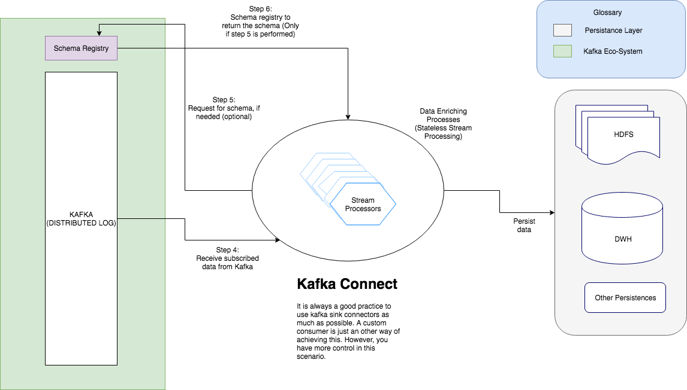

# Kafka Avro Message Consumer

This application is used to read messages from Kafka which was produced by a producer registering the schema in a [schema registry](). The messages read can be evolved gracefully uing the schema registry and in this case used `BACKWARD` compatibility. Also, this application can be used as an example for a stateless stream processing job which would involve processing one event at a time or filtering though a stream of events.

This application follows a [12-Factor App]() methodology.

> Note: This is just an alternative to Kafka Connect and should be used only in the case of some bespoke scenario's which cannot be accomplished using the connect cluster.

## Functional Requirement
Read avro messages from kafka with difference schemas

## Dataflow Diagram



## Prerequisits

You need to have the following before you can start using this application

* JDK 1.8 +
* Zookeeper
* Kafka
* [Schema Registry]()
* [Kafka Commons](https://github.com/reddy-s/kafka-commons) maven dependency

## Setup process

Clone the repo and `cd` into the root directory of the repo.

Run the following command to build the application
```sbtshell
mvn clean install
```

Run the application using
```sbtshell
java -jar ./target/*.jar
```

The configuration for the application can be externalized by using a dedicated config server or by having a properties file.

The following are the available customizing options
```yaml
# Kafka settings
kafka:
  topic: Tweets
  consumer:
    group-id: tweet-reader
  bootstrap:
    servers: localhost:9092

# Schema registry settings
schema:
  registry:
    url: http://localhost:8081

# Server settings
server:
  port: 10002

# Application settings
info:
  app:
    name: Kafka Consumer Application (Stateless stream processing)
    description: Read messages from kafka using avro desrialization, transform and persist messages
    version: 1.0.0

# Actuator settings
management:
  endpoints:
    web:
      exposure:
        include: info,health,metrics,beans
```

### Monitoring and Operations

#### Application health
Uses Spring's Actuator project. This can be used to track the health of the application, application metrics and beans registered.

#### Logs
Makes use of `slf4j` for logging. All the logs are spit out to the console, but can be configured to do otherwise.

#### Operations
Prefered to run in a container, and `fluentd` can be used to ship the logs to a `fluentd` agent and searched in `Splunk` or `Elastic Search`.

`K8s` ready

## How to check if the application is running as expected

* The console would spit out logs of data being consumed like shown below

```sbtshell
2018-04-05 10:49:12.808  INFO 41397 --- [et-reader-0-C-1] i.d.k.c.service.KafkaTweetConsumer       : Tweet received - 981831108747673602
2018-04-05 10:49:12.808  INFO 41397 --- [et-reader-0-C-1] i.d.k.c.p.impl.SchemaV1Processor         :
id: 981831108747673602
text: RT @DarlingSpectrum: My dream is to lift the dark social stigma surrounding mental health within my country and the world. For people to lo…
lang: en
isRetweet: true
tweetedOn: 2018-49-05 10:49:12
```

The record (GenericRecord) would have the schema reflecting the one in schema registry. You can check that out by issuing the following cURL command

```sbtshell
curl -X GET \
  http://localhost:8081/subjects/TweetRegistry/versions/latest \
  -H 'Cache-Control: no-cache' 
```

## Adding new schemas to read - Schema Evolution

This application implements an [Abstract Factory Pattern]() which makes it easy to add new schemas.

Things to do:
* Add a new class which extends `ProcessorAbstract` which would overwrite `processor` method. You can add in your own processing logic here.
* Add a condition to return your `Schema Processor` when needed in the `ProcessorFactory` class
* Thats it!


Check out the [Kafka-Avro-Producer](https://github.com/reddy-s/kafka-avro-producer) which can be used to consume these tweets with a `BACKWARD` compatibility level of the schema.
